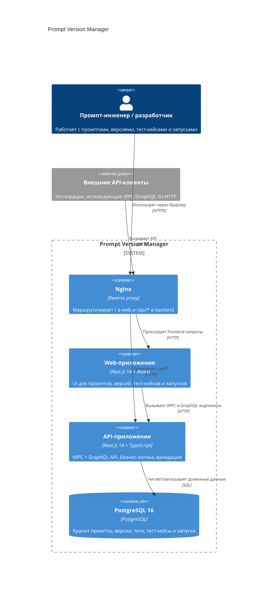

# C4-container

```mermaid
C4Container
  title Prompt Version Manager

  Person(promptEngineer, "Промпт-инженер / разработчик", "Работает с промптами, версиями, тест-кейсами и запусками")
  System_Ext(extClients, "Внешние API-клиенты", "Интеграции, использующие tRPC/GraphQL по HTTP")

  System_Boundary(pvm, "Prompt Version Manager") {
    Container(nginx, "Nginx", "Reverse proxy", "Маршрутизирует / в web и /api/* в backend")
    Container(web, "Web-приложение", "Next.js 14 + React", "UI для промптов, версий, тест-кейсов и запусков")
    Container(api, "API-приложение", "Next.js 14 + TypeScript", "tRPC + GraphQL API, бизнес-логика, валидация")
    ContainerDb(db, "PostgreSQL 16", "PostgreSQL", "Хранит промпты, версии, теги, тест-кейсы и запуски")
  }

  Rel(promptEngineer, nginx, "Использует через браузер", "HTTPS")
  Rel(extClients, nginx, "Вызывает API", "HTTP")

  Rel(nginx, web, "Проксирует frontend-запросы", "HTTP")
  Rel(nginx, api, "Проксирует /api/*", "HTTP")

  Rel(web, api, "Вызывает tRPC и GraphQL эндпоинты", "HTTP")
  Rel(api, db, "Читает/записывает доменные данные", "SQL")
```
