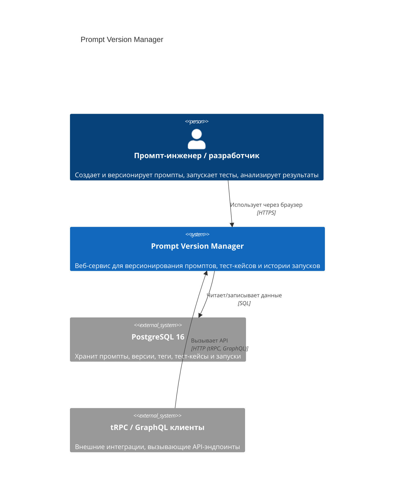

# C4-context

```mermaid
C4Context
  title Prompt Version Manager

  Person(promptEngineer, "Промпт-инженер / разработчик", "Создает и версионирует промпты, запускает тесты, анализирует результаты")

  System(pvm, "Prompt Version Manager", "Веб-сервис для версионирования промптов, тест-кейсов и истории запусков")

  System_Ext(postgres, "PostgreSQL 16", "Хранит промпты, версии, теги, тест-кейсы и запуски")
  System_Ext(trpcClients, "tRPC / GraphQL клиенты", "Внешние интеграции, вызывающие API-эндпоинты")

  Rel(promptEngineer, pvm, "Использует через браузер", "HTTPS")
  Rel(pvm, postgres, "Читает/записывает данные", "SQL")
  Rel(trpcClients, pvm, "Вызывает API", "HTTP (tRPC, GraphQL)")
```
