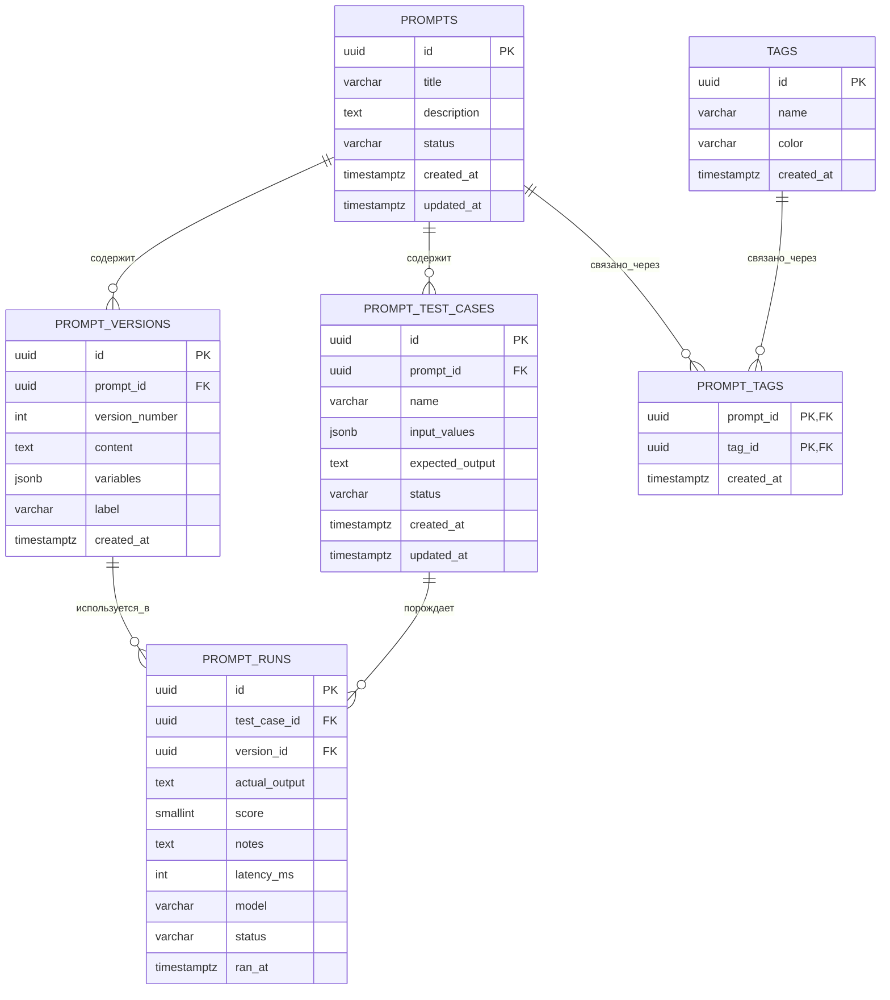

# ERD (схема БД PostgreSQL)

```mermaid
erDiagram
    PROMPTS {
        uuid id PK
        varchar title
        text description
        varchar status
        timestamptz created_at
        timestamptz updated_at
    }

    PROMPT_VERSIONS {
        uuid id PK
        uuid prompt_id FK
        int version_number
        text content
        jsonb variables
        varchar label
        timestamptz created_at
    }

    TAGS {
        uuid id PK
        varchar name
        varchar color
        timestamptz created_at
    }

    PROMPT_TAGS {
        uuid prompt_id PK, FK
        uuid tag_id PK, FK
        timestamptz created_at
    }

    PROMPT_TEST_CASES {
        uuid id PK
        uuid prompt_id FK
        varchar name
        jsonb input_values
        text expected_output
        varchar status
        timestamptz created_at
        timestamptz updated_at
    }

    PROMPT_RUNS {
        uuid id PK
        uuid test_case_id FK
        uuid version_id FK
        text actual_output
        smallint score
        text notes
        int latency_ms
        varchar model
        varchar status
        timestamptz ran_at
    }

    PROMPTS ||--o{ PROMPT_VERSIONS : содержит
    PROMPTS ||--o{ PROMPT_TEST_CASES : содержит

    PROMPTS ||--o{ PROMPT_TAGS : связано_через
    TAGS ||--o{ PROMPT_TAGS : связано_через

    PROMPT_TEST_CASES ||--o{ PROMPT_RUNS : порождает
    PROMPT_VERSIONS ||--o{ PROMPT_RUNS : используется_в
```
