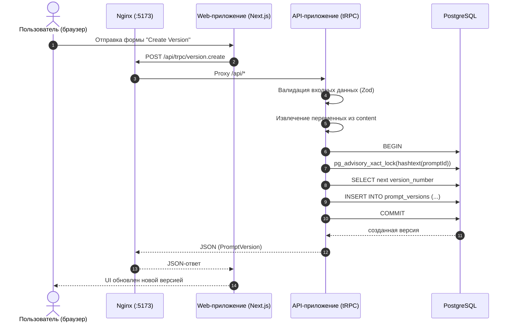
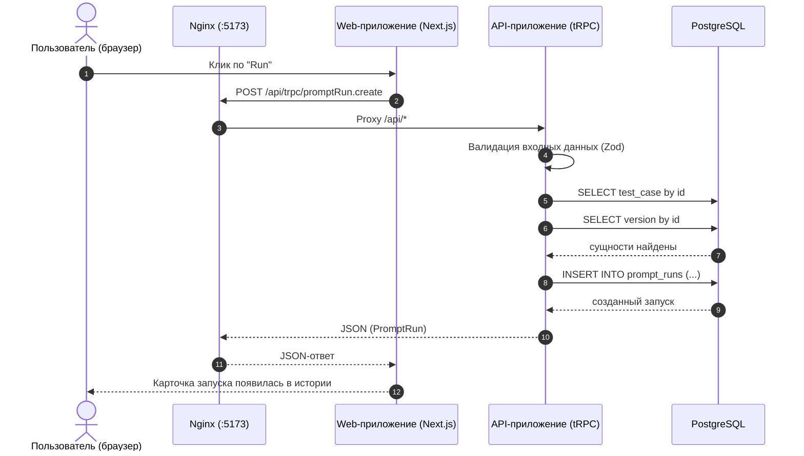
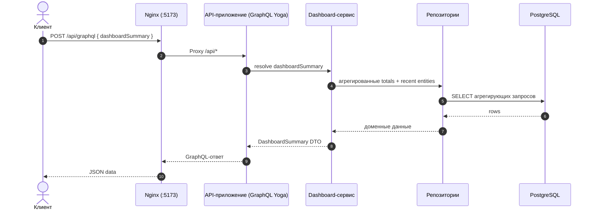

# Sequence diagrams

## 1) Создание версии промпта

```mermaid
sequenceDiagram
    autonumber
    actor U as Пользователь (браузер)
    participant N as Nginx (:5173)
    participant W as Web-приложение (Next.js)
    participant A as API-приложение (tRPC)
    participant DB as PostgreSQL

    U->>W: Отправка формы "Create Version"
    W->>N: POST /api/trpc/version.create
    N->>A: Proxy /api/*

    A->>A: Валидация входных данных (Zod)
    A->>A: Извлечение переменных из content

    A->>DB: BEGIN
    A->>DB: pg_advisory_xact_lock(hashtext(promptId))
    A->>DB: SELECT next version_number
    A->>DB: INSERT INTO prompt_versions (...)
    A->>DB: COMMIT

    DB-->>A: созданная версия
    A-->>N: JSON (PromptVersion)
    N-->>W: JSON-ответ
    W-->>U: UI обновлен новой версией
```

## 2) Запуск тест-кейса на версии

```mermaid
sequenceDiagram
    autonumber
    actor U as Пользователь (браузер)
    participant N as Nginx (:5173)
    participant W as Web-приложение (Next.js)
    participant A as API-приложение (tRPC)
    participant DB as PostgreSQL

    U->>W: Клик по "Run"
    W->>N: POST /api/trpc/promptRun.create
    N->>A: Proxy /api/*

    A->>A: Валидация входных данных (Zod)
    A->>DB: SELECT test_case by id
    A->>DB: SELECT version by id
    DB-->>A: сущности найдены

    A->>DB: INSERT INTO prompt_runs (...)
    DB-->>A: созданный запуск
    A-->>N: JSON (PromptRun)
    N-->>W: JSON-ответ
    W-->>U: Карточка запуска появилась в истории
```

## 3) GraphQL-запрос: Dashboard Summary

```mermaid
sequenceDiagram
    autonumber
    actor C as Клиент
    participant N as Nginx (:5173)
    participant A as API-приложение (GraphQL Yoga)
    participant S as Dashboard-сервис
    participant R as Репозитории
    participant DB as PostgreSQL

    C->>N: POST /api/graphql { dashboardSummary }
    N->>A: Proxy /api/*
    A->>S: resolve dashboardSummary
    S->>R: агрегированные totals + recent entities
    R->>DB: SELECT агрегирующих запросов
    DB-->>R: rows
    R-->>S: доменные данные
    S-->>A: DashboardSummary DTO
    A-->>N: GraphQL-ответ
    N-->>C: JSON data
```
